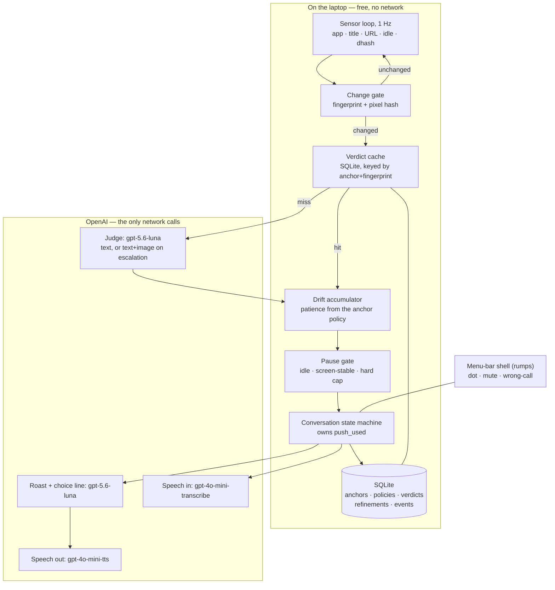
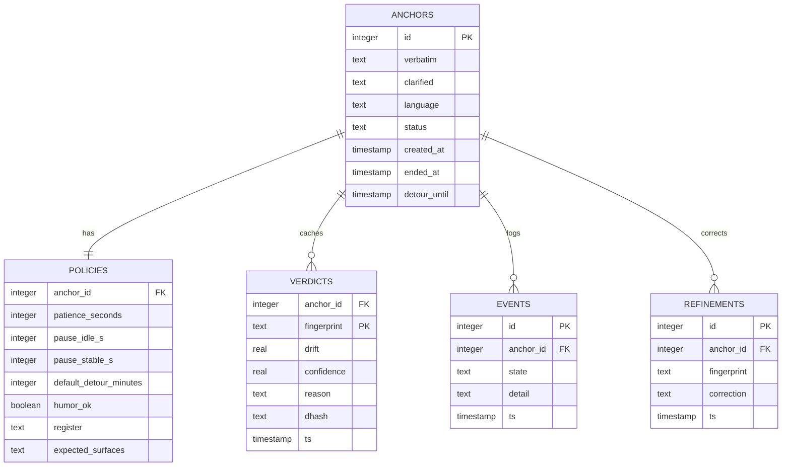

# Anchor — Architecture

> Approved by Baharul Islam on 6 September 2026. Produced by the Fuller pipeline.
> This file is the source of truth for how Anchor is built. Do not deviate without updating it.

---

## What this system is

Anchor is a single background program on macOS with no window and nothing to open. When the user starts work it asks
aloud what they are working on; they answer in one spoken sentence and that sentence becomes **the anchor**. From then
on it is silent. Once a second it reads — locally and for free — which app is in front, what the window is called,
which site is open, how long since the last keystroke, and a perceptual hash of the screen. If nothing changed,
nothing happens. If the context has been seen before under this anchor, a local cache answers without a network call.
Only a genuinely new context is judged by a model, and only as text; a screenshot is sent solely when the cheap
signals are ambiguous — above all when the pixels changed a lot while the window title did not, which is exactly how
drifting *inside* one app hides.

Off-task readings accumulate into a drift timer whose patience is set per anchor by the task itself. When it fills,
Anchor waits for a natural pause and then speaks **once**: a short funny roast of the gap between what the user said
and what they are doing, immediately followed by a forced choice — short break, or new main task? Exactly one
push-back is permitted if the user is evasive, and that push-back is deliberately flat and quotes the anchor verbatim.
Three answers drive three branches. Everything persists in one local SQLite file. Screenshots are never written to disk.

---

## Requirements & constraints

**Purpose:** hackathon demo/prototype. Single user (the builder), plus judges watching a live demo. No concurrency.
**Runs on:** MacBook Air (Apple Silicon assumed), macOS 14+, fully local.
**Budget:** OpenAI API keys available. Everything else must be free. No paid hosting, no backend.
**Languages:** voice in and out, English and Hindi.
**Research tier:** Quick (demo).
**Production Gate:** skipped (demo project).

### Requirements traced to design elements

| Requirement (user's words) | Design element |
|---|---|
| "one spoken sentence at the start" | `ANCHORING` state; anchor stored verbatim; exactly one clarifying question |
| "anything on my desktop", not browser-only | Context Frame samples app + title + URL for every app type |
| "some screenshot and some mapping" | fingerprint = the mapping; dhash = the pixel map; both local and free |
| "if mapping very different… screenshot + vision to verify" | vision escalation, incl. the hash-diverged-but-title-same trigger |
| "so fast and cheap" | four free local layers plus a verdict cache before any paid call |
| "shouldn't immediately speak when shifted" | drift accumulator, never a single-sample trigger |
| "more than a restricted time" | `policy.patience_seconds`, per anchor |
| "natural pause depends on the task" | `pause_idle_s` / `pause_stable_s` from the policy + hard cap for scroll-holes |
| "coding → ChatGPT/StackOverflow ok for a while, but not gaming" | semantic judgement against the anchor + `expected_surfaces`; time-boxed tolerance |
| "roast me instead of directly talking" | `ROASTING` step opens every confrontation (see Conversation) |
| "funny so the user doesn't get angry or frustrated" | gap-not-person contract, banned list, register ladder, auto-cooldown, tone gate, confidence gate, repeat-decay |
| "when user says remind after sometime it will do so" | `DETOUR` branch with an absolute wall-clock deadline in SQLite |
| holds ground once, then accepts | `push_used` boolean owned by the state machine |
| three answers | `DEFER` / `SWITCH` / `DONE` branches |
| "yes, and full local" | SQLite in Application Support; resume on relaunch; no backend |
| "see what is best" (privacy) | screenshots never persisted; only ambiguous frames leave; cache means most switches never do |

### Recorded assumptions (user said "you decide" or did not specify)

- A1. Apple Silicon MacBook Air, macOS 14 (Sonoma) or later.
- A2. A minimal menu-bar presence (a coloured dot + a small transcript window) is acceptable even though the product
  is "nothing to open", because judges must be able to *see* the state machine during a live demo.
- A3. Single user, no accounts, no cloud sync, no multi-device.
- A4. Demo-tier engineering: no HA, no scaling. Reliability effort goes into the live demo not failing.
- A5. Data leaving the machine is limited to: the anchor sentence, app names, trimmed window titles, escalation
  screenshots, and voice audio — to OpenAI only.

---

## Architecture



### Component 1 — Menu-bar shell

**Technology:** [`rumps`](https://github.com/jaredks/rumps) (MIT) with `LSUIElement: True` via py2app.
**What it does:** owns the process, shows a status dot (grey idle / green on-task / amber drifting / red confronting),
and exposes exactly three menu items: **Mute**, **Wrong call**, **Quit**. Optionally a small transcript window for
the demo.
**Why:** it is the only way to get a Python daemon into the macOS menu bar in a few lines, and `LSUIElement` removes
the Dock icon entirely — literally the "nothing to open" requirement.
**Hard rule:** `rumps` owns the main `NSApplication` run loop. **Every network call must run on a worker thread** and
marshal results back through a queue. A blocking call on the main thread freezes the menu bar.

### Component 2 — Sensor loop (1 Hz)

**Technology:** PyObjC — `NSWorkspace.sharedWorkspace().frontmostApplication()` for the app; JXA/AppleScript for the
window title; AppleScript for the front tab URL in Chrome/Safari/Arc; `Quartz.CGEventSourceSecondsSinceLastEventType`
for idle seconds; `screencapture -x` (or CoreGraphics) into memory for the hash.
**Pattern source:** [ActivityWatch's `aw-watcher-window`](https://github.com/ActivityWatch/aw-watcher-window), which
has run this loop cross-platform for years at a 1.0 s default poll.
**Emits a Context Frame every second:** `{ts, app, bundle_id, title, url_domain, idle_s, dhash}`.
**Hard rule:** every title/URL read is wrapped in try/except and **degrades to app-name-only, never crashes the loop**
— ActivityWatch [issue #59](https://github.com/ActivityWatch/activitywatch/issues/59) is that exact failure when
Accessibility is not granted.

### Component 3 — Change gate

**Technology:** string normalisation + [`dhash`](https://github.com/benhoyt/dhash) (MIT) over a downscaled grayscale
grab.
`fingerprint = normalize(app + "|" + title_head + "|" + url_domain)`. Hamming distance between consecutive dhashes
gives pixel divergence.

| Fingerprint | Pixel hash | Meaning | Action |
|---|---|---|---|
| same | same | nothing happened | drop, no cost |
| changed | changed | ordinary context switch | judge (cache first) |
| **same** | **diverged (Hamming > 12/64)** | in-page navigation, SPA, video started | judge, **force vision** |
| changed | same | cosmetic title change | judge (text) |

**Why:** this is the user's stated "mapping" idea made concrete, and it costs nothing.
**Limitation to respect:** dhash is content-blind — a playing video changes the hash every frame. Pixel divergence may
therefore only trigger a *look*, never a *verdict*.

### Component 4 — Verdict cache

**Technology:** SQLite table keyed `(anchor_id, fingerprint)` → `{drift, confidence, reason, ts}`. TTL 30 minutes.
**Invalidation:** a pixel-hash divergence on the same fingerprint invalidates that entry, so a page that changed
content under a constant title cannot serve a stale verdict.
**Why:** people cycle between a handful of contexts all day. After the first hour, most switches never reach the
network. This is the single biggest cost lever in the design.

### Component 5 — Drift accumulator

Off-task tick (`drift ≥ 0.5`): `drift_seconds += 1`. On-task tick: `drift_seconds -= 2` (floor 0).
Asymmetric decay means it forgives fast and remembers slowly.
Fires when `drift_seconds ≥ policy.patience_seconds`.
Low-confidence verdicts (`confidence < 0.6`) do **not** advance the timer; they hold it.

### Component 6 — Pause gate

Speak only when **one** of:
- `idle_s ≥ policy.pause_idle_s`, or
- the fingerprint and pixel hash have both been stable for `policy.pause_stable_s` (this is the pause signal for
  video-watching tasks, where input-idle means "paying attention", not "available"), or
- `drift_seconds ≥ 2 × patience` — the **hard cap**, which is what catches endless scrolling where input never
  goes idle and the screen never settles.

Never speak when: another process holds the microphone (call in progress), macOS Focus/Do-Not-Disturb is on, the
screen is locked, or Mute is set.

### Component 7 — Conversation state machine (the protected part)

States: `IDLE → ANCHORING → WATCHING → DRIFTING → CONFRONTING → [PUSHED] → {DETOUR | SWITCH | DONE} → WATCHING`.

```python
def confront(anchor, observed, policy):
    push_used = False                              # owned by this function, not the model
    roast, choice = compose_confrontation(anchor, observed, policy)
    speak(roast + " " + choice) if policy.humor_ok and confidence_ok else speak(hedged(observed) + " " + choice)
    reply  = listen(window_s=8)
    intent = classify(reply)                       # DEFER | SWITCH | DONE | EVASIVE
    if intent == "EVASIVE" and not push_used:
        push_used = True
        speak(f"You said: {anchor.verbatim}. Still true?")   # flat tone, no joke, ever
        reply  = listen(window_s=8)
        intent = classify(reply)
        if intent == "EVASIVE":
            intent = ("DEFER", policy.default_detour_minutes)  # accept, do not argue
    apply(intent)
```

The one-push-back guarantee is a boolean in this function. The model is never given a second opportunity to push,
so it cannot nag even if a prompt is mis-worded. A hard ceiling of **4 confrontations per hour** applies regardless
of drift, so no bug can produce nagging.

**Branches:**
- `DEFER(n)` — anchor unchanged; `detour_until` written as an **absolute wall-clock timestamp** in SQLite (not a
  sleeping thread), so lid-close, sleep, crash and relaunch all still fire it. Monitoring is **fully paused** for the
  duration: no judging, no cost, no second nudge. On expiry it speaks a **plain** line — never a roast — quoting the
  anchor. If the app was quit during the detour, the reminder fires on next launch and acknowledges the delay.
  Free-form durations are parsed ("twenty minutes", "half an hour", "till 9", "thoda der" → policy default) and
  confirmed back in one clause.
- `SWITCH(sentence)` — old anchor marked `retired`; the new sentence becomes the anchor; a policy is derived; the
  clarifying question is **skipped** (do not interrogate mid-flow); back to `WATCHING`.
- `DONE` — anchor marked `completed`; one line of congratulation; then "What's next?" → `ANCHORING`.

### Component 8 — The roast layer

Generated in the same structured call as the choice line: `{roast: str, choice_line: str}`.

**Contract — enforced in the prompt AND validated on the output:**
1. The subject of the joke is always the **gap** between the stated anchor and the observed activity. Never the person.
2. Banned entirely: appearance, intelligence, discipline-as-character-flaw, relationships, money, weight, family,
   and profanity (profanity is opt-in via config, default off).
3. Must be **specific** — it names the actual activity and the actual elapsed time. Generic roasts are rejected and
   regenerated once; on a second failure the system falls back to a plain statement.
4. Max 2 sentences, max 30 words.

**Four gates, any one of which suppresses the joke:**
- `policy.humor_ok == False` — set at anchor time when the goal reads as medical, financial, grief-adjacent or
  otherwise heavy. The system then states plainly.
- `confidence < 0.75` — a joke makes a false accusation land twice as hard, so uncertainty gets a hedged observation.
- Register has been cooled to `dry` **and** this is a repeat confrontation.
- Mute is on.

**Register ladder:** `dry | playful | spicy`, default `playful`. The reply classifier returns a `sentiment` field;
`irritated` drops the register one step **for the rest of the session and never climbs back automatically**.
**Repeat-decay within one anchor:** confrontation 1 gets the full line, 2 is shorter, 3+ is a single clause.
**Language parity:** Hindi/Hinglish roasts are generated natively in that language, never translated from English.
**The push-back never carries a roast.** The tonal drop from joke to flat sentence is what gives it weight.

### Component 9 — Anchor intake & policy

The user speaks one sentence. The system asks **at most one** clarifying question (the published ablation shows the
clarification step is the single biggest accuracy lever, +6.6 points; the same study found two questions burdensome
for 36.4% of participants — hence one). It then emits:

```json
{
  "clarified_anchor": "finish the DBMS assignment, section 3",
  "verbatim_anchor": "I need to finish the assignment tonight",
  "language": "en",
  "patience_seconds": 240,
  "pause_idle_s": 4,
  "pause_stable_s": 10,
  "expected_surfaces": ["chatgpt", "claude", "stackoverflow", "google", "docs"],
  "default_detour_minutes": 15,
  "humor_ok": true
}
```

Reference policies: coding → patience 240 s, expects AI chats/StackOverflow/Google; writing → 150 s; watching a
lecture → 420 s with `pause_idle_s` irrelevant and `pause_stable_s` 10.

### Component 10 — Voice I/O

**Out:** `gpt-4o-mini-tts`, voice `cedar` or `marin`, `response_format="pcm"`, streamed through the Python SDK's
`LocalAudioPlayer`. The `instructions` field carries the delivery brief and **changes by state**: for the roast,
"light, dry, amused, never mocking"; for the push-back, "flat, calm, matter-of-fact". Language mirrors the anchor.
**In:** `sounddevice` capture → `webrtcvad` endpointing (hard 8 s cap so a silent room cannot hang a turn) →
`gpt-4o-mini-transcribe`.
**Panic paths:** macOS `say` for output, menu-bar buttons for input, if the network fails on stage.
**Policy:** OpenAI's usage policy requires disclosing that the voice is AI-generated — spoken once on first run.

---

## Models

| Task | Model | Role | Why it wins | Fallback |
|---|---|---|---|---|
| Drift judgement (text) | [`gpt-5.6-luna`](https://developers.openai.com/api/docs/models/gpt-5.6-luna) | returns `{drift, reason, confidence}` | $0.20/M in, **$0.02/M cached in**, $1.20/M out; structured outputs; 1.05M context; Tier-1 500 RPM vs our <1/min | local verdict cache (free) below it; `gpt-5.6-terra` above it |
| Drift judgement (vision) | `gpt-5.6-luna` with an image | same verdict, with a downscaled screenshot | **same model, same prompt, same cached prefix** — one code path for both modalities | `gpt-5.6-terra` |
| Roast + choice line | `gpt-5.6-luna` | `{roast, choice_line}` | same call, negligible extra output tokens | plain templated statement |
| Reply classification | `gpt-5.6-luna` | `{intent, minutes, new_anchor, sentiment}` | structured outputs make the branch deterministic | keyword matcher |
| Speech out | [`gpt-4o-mini-tts`](https://developers.openai.com/api/docs/guides/text-to-speech) | spoken lines | Hindi supported; `pcm` streaming; `instructions` controls tone per state | macOS `say` |
| Speech in | `gpt-4o-mini-transcribe` | user replies | multilingual, Hindi covered | `faster-whisper` local |

**Escalate to vision when:** pixel hash diverged while the fingerprint held, OR `confidence < 0.6`, OR `drift` lands
in the ambiguous band 0.35–0.65, OR the title is uninformative (bare app name, "New Tab", "Untitled").
**Image handling:** downscale to ~768 px on the long edge, JPEG, sent from memory, **never written to disk**.
**Switching criterion (documented for the maintainer):** if the eval's false-accusation rate exceeds 1 in 20
confrontations, move the judge up a rung to `gpt-5.6-terra`.

---

## Data flows

```mermaid
sequenceDiagram
    participant U as User
    participant S as Sensor (1 Hz)
    participant L as Local gates + cache
    participant M as Luna
    participant V as Voice
    U->>V: "I need to finish the assignment tonight"
    V->>M: clarify (one question max) + derive policy
    M-->>L: anchor + policy stored
    loop every second
        S->>L: context frame
        L-->>L: unchanged or cached → stop (no cost)
        L->>M: new context (text; + image if ambiguous)
        M-->>L: {drift, reason, confidence}
        L-->>L: drift timer fills / drains
    end
    L->>L: timer full → wait for natural pause
    L->>M: compose {roast, choice_line}
    M-->>V: two lines
    V->>U: roast, then the choice
    U-->>V: reply
    V->>M: classify {intent, minutes, sentiment}
    alt DEFER
        M-->>L: pause monitoring, store absolute deadline
        L->>V: on expiry, plain pull-back (no roast)
    else SWITCH
        M-->>L: retire old anchor, adopt new sentence
    else DONE
        M-->>L: mark complete, ask what's next
    else EVASIVE (once only)
        V->>U: flat push-back quoting the anchor verbatim
    end
```

### The same flow in plain steps

1. Launch → dot appears → it asks what the user is working on (first run also speaks the AI-voice disclosure once).
2. The user answers in one sentence, English or Hindi; it is transcribed and stored **word-for-word**.
3. One clarifying question at most, then the anchor policy is derived.
4. Every second: front app, window title, browser URL, idle seconds, screen hash — all local.
5. Nothing changed → nothing happens, no network, no cost.
6. Something changed → check the local cache first.
7. Genuinely new context → judged as text; a drift score comes back.
8. Ambiguous → a downscaled screenshot is added to the same call.
9. Off-task seconds accumulate; on-task seconds drain the timer twice as fast.
10. Timer full → **wait** for idle, or a still screen, or the hard cap.
11. Speak once: roast, then the choice.
12. One push-back available if the reply dodges (silence counts as dodging), then accept whatever comes.
13. Run the branch. Detour pauses monitoring entirely and fires a plain reminder later.
14. Persist to SQLite. Discard the screenshot from memory.

---

## Data model



Location: `~/Library/Application Support/Anchor/anchor.db`, file mode `0600`.
`status` ∈ `active | retired | completed`. `register` ∈ `dry | playful | spicy`.
`REFINEMENTS` carries the "wrong call" feedback loop locally — the published ablation shows feedback is worth about
4 accuracy points, and it needs no cloud to work: refinements are prepended to later judgements for the same day.
**No table stores a screenshot.** Frames are hashed and optionally sent, then dropped.

---

## Security, safety & guardrails

**Secrets.** `OPENAI_API_KEY` read from `.env` via `python-dotenv`. Never logged, never printed, never written to the
database. `.env` is git-ignored.

**Data protection.** Everything local. No backend, no telemetry, no sync. Screenshots exist only in memory. Only the
anchor sentence, app names, trimmed window titles (first 120 chars), escalation images and voice audio ever leave the
machine, and only to OpenAI. A config switch `EXCLUDE_TITLES=1` degrades sensing to app-name-only for people who
don't want titles sent at all (ActivityWatch offers the same escape hatch).

**Prompt injection.** On-screen text is untrusted input. It is placed in a delimited, labelled block; the judge is
given **no tools**; and the response is a structured JSON verdict only. A web page saying "ignore your instructions"
can at worst skew a drift score — it can never cause an action. The same applies to the roast generator: it returns
text that is spoken, never executed.

**Output filtering (the roast).** Post-generation validation against the banned list and the length cap. On failure:
regenerate once, then fall back to a plain statement. Sensitive-anchor tone gate and confidence gate applied before
generation.

**Hallucination containment.** Low confidence holds the timer instead of advancing it; the ambiguous band escalates
to vision rather than guessing; the judge must emit a short reason before the score, which both improves accuracy and
makes every verdict auditable in the log.

**Human oversight.** The whole product is human-in-the-loop by construction. The menu-bar **Wrong call** item writes
a refinement. The user's answer always wins — including a bad answer.

**Rate limiting & abuse ceiling.** Max 4 confrontations per hour regardless of drift. Max 1 push-back per
confrontation. No confrontation during a sanctioned detour.

**Kill switch.** Menu-bar **Mute** stops all speech immediately; environment variable `ANCHOR_SILENT=1` starts muted;
**Quit** ends the process cleanly and preserves the active anchor for the next launch.

**Backups & recovery.** The database is a single file the user can copy. A corrupt database is renamed aside and
recreated empty rather than crashing the app.

**Permissions.** Accessibility (window titles) and Screen Recording (screenshots) are separate macOS TCC grants. The
app detects a missing grant, degrades gracefully, and tells the user which one is missing — it never silently
misbehaves.

---

## Scaling plan & cost

**Stated scale is one user on one laptop**, so this section is about honesty rather than machinery.

Realistic hour: ~40 genuinely new contexts and ~8 vision escalations.
- Judge text: 40 calls × ~700 cached tokens @ $0.02/M ≈ $0.0006; ~100 fresh tokens each @ $0.20/M ≈ $0.0008;
  ~60 output tokens each @ $1.20/M ≈ $0.0029.
- Vision: 8 × ~900 image tokens @ $0.20/M ≈ $0.0014.
- **Monitoring ≈ half a cent per hour.**
- Conversations: ~3/hour, each ≈ 2 short spoken lines plus a transcription ≈ $0.01.
- **All-in ≈ 3–4 cents per hour.** A full week of building and testing ≈ $1–2.

Tier-1 limits for Luna are 500 RPM / 500,000 TPM against a design issuing well under 1 request per minute — not a
constraint.

**What breaks if this ever became a product** (not needed now, documented so it isn't rediscovered):
1. A 1 Hz Python loop as a long-lived daemon — ActivityWatch rewrote theirs in Rust for exactly this reason.
2. One API key per user — needs a backend proxy and per-user quotas.
3. No shared verdict cache across users — the same fingerprints would be re-judged for everybody.

---

## Production gate result

**Skipped (demo project).**

---

## Alternatives rejected

- **Realtime speech-to-speech (`gpt-realtime-2.1`) as the default.** 10–40× the cost, but the real reason is that it
  hands turn-taking to the model, which would make "exactly one push-back" a prompt hope instead of a code
  guarantee. Specified as an upgrade rung behind the same voice interface if time allows.
- **A screenshot every 2 seconds** (the published approach). Works, but it is the expensive path, the path that drew
  privacy complaints from 54.6% of that study's participants, and it means constant screen capture on a fanless Air.
- **App or website blocklists.** Cannot distinguish "Google while coding" from "Google, then gaming" — the exact
  distinction this product exists to make.
- **A cloud backend.** Needed by the research team for an IRB study with 22 participants; pure liability for one user.
  Deleting it removes the entire privacy surface for free.
- **A local open-weight vision model on the Air.** Free per call, but a large download, slow on battery, and the most
  likely thing to fail on stage.
- **Roasting on the push-back too.** Rejected: two jokes in a row make the whole interaction read as a bit that can be
  waved away, which defeats the purpose of the push-back.

---

## Sources

**Verified in this session (fetched):**
- gpt-5.6-luna model page — pricing, modalities, limits: https://developers.openai.com/api/docs/models/gpt-5.6-luna
- Text-to-speech guide — Hindi support, `pcm`, `instructions`, AI-voice disclosure: https://developers.openai.com/api/docs/guides/text-to-speech
- Realtime & audio overview — `gpt-realtime-2.1`, WebSocket vs WebRTC: https://developers.openai.com/api/docs/guides/realtime
- "State Your Intention to Steer Your Attention" (INA), CHI 2026 — accuracy 0.878 / F1 0.845; real-world 0.899;
  off-task 0.104 vs 0.166; clarification ablation 0.805→0.871; **workflow disruption 3.09 vs 3.91, p=.0056**;
  54.6% privacy concerns; note that streamed video often does not appear in screenshots:
  https://arxiv.org/html/2510.14513v3
- macOS Accessibility permission required for window titles: https://github.com/ActivityWatch/aw-watcher-window
- Title-read failure mode without permission: https://github.com/ActivityWatch/activitywatch/issues/59
- `CGEventSourceSecondsSinceLastEventType`: https://developer.apple.com/documentation/coregraphics/cgeventsource/secondssincelasteventtype(_:eventtype:)
- rumps: https://github.com/jaredks/rumps · dhash: https://github.com/benhoyt/dhash · ImageHash: https://pypi.org/project/ImageHash

**[unverified] — confirm before quoting:**
- Per-token rates for `gpt-4o-mini-tts` and `gpt-4o-mini-transcribe`. The official pricing page could not be reached
  in this session and third-party aggregators disagree ($0.60/M vs $2.50/M input for TTS). The cost conclusion holds
  at either figure. Check https://developers.openai.com/api/docs/pricing.
- Realtime audio rates (~$32/M in, ~$64/M out) — third-party, only relevant if the upgrade rung is taken.
